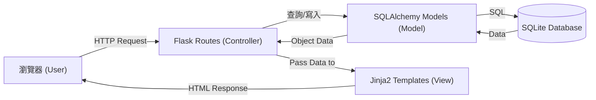

# 系統架構設計 (ARCHITECTURE.md) - 食譜收藏夾系統

## 1. 技術架構說明

本專案採用經典的 **Monolith (單體) 架構**，結合 Flask 框架與 Jinja2 模板引擎，實現快速開發與簡易部署。

### 技術選型
*   **後端框架**: Python Flask (輕量、靈活，適合小型到中型 Web 專案)
*   **模板引擎**: Jinja2 (由 Flask 伺服器渲染 HTML，SEO 友好且開發門檻低)
*   **資料庫**: SQLite (無須額外安裝伺服器，單一檔案即可存儲所有資料)
*   **ORM**: SQLAlchemy (選用，減少撰寫原生 SQL 的錯誤，提高程式碼可讀性)

### Flask MVC 模式說明
雖然 Flask 本身沒有強制規範架構，但我們遵循 MVC 設計模式來組織程式碼：
*   **Model (模型)**: 負責處理資料邏輯，定義資料庫結構（Schema）。
*   **View (視圖)**: 即 Jinja2 HTML 模板，負責將資料呈現給使用者。
*   **Controller (控制器)**: 負責處理使用者的請求（Route），協調 Model 與 View。

---

## 2. 專案資料夾結構

建議的資料夾結構如下，確保程式碼職責分離：

```text
recipe_app/
├── app/
│   ├── __init__.py         # 初始化 Flask App 與資料庫
│   ├── models/             # 資料庫模型 (Model)
│   │   ├── user.py
│   │   ├── recipe.py
│   │   └── ingredient.py
│   ├── routes/             # 路由控制 (Controller)
│   │   ├── auth.py         # 註冊與登入
│   │   ├── recipe.py       # 食譜 CRUD
│   │   └── admin.py        # 管理員功能
│   ├── templates/          # HTML 模板 (View)
│   │   ├── base.html       # 共用導覽列與底稿
│   │   ├── index.html
│   │   └── ...
│   └── static/             # 靜態資源
│       ├── css/
│       ├── js/
│       └── images/
├── instance/               # 存放敏感或變動資料
│   └── database.db         # SQLite 資料庫檔案
├── docs/                   # 專案文件 (PRD, Architecture)
├── requirements.txt        # 專案套件依賴清單
└── app.py                  # 專案啟動點 (EntryPoint)
```

---

## 3. 元件關係圖

以下展示了系統在處理使用者請求時的流轉過程：



---

## 4. 關鍵設計決策

### 決策 1：不採用前後端分離 (Single Page App)
*   **理由**: 對於食譜系統，SEO (搜尋引擎優化) 較為重要。使用 Flask + Jinja2 的伺服器端渲染 (SSR) 能確保食譜內容容易被搜尋引擎索引，且降低開發複雜度，適合 MVP 快速上線。

### 決策 2：食材與食譜採多對多 (Many-to-Many) 關聯
*   **理由**: 一個食譜包含多種食材，一種食材也可出現在多個食譜中。透過中間關聯表，可以輕鬆實現「勾選多種食材找對應食譜」的核心功能。

### 3. 使用 Flask-Login 處理驗證
*   **理由**: 作為 Flask 最成熟的套件之一，它能安全地處理 Session、登入狀態保持以及權限檢查 (如 `@login_required`)，減少自行開發的身分認證漏洞。

### 4. 圖片儲存方式：本地目錄 + 資料庫存路徑
*   **理由**: 對於初期的食譜圖片，直接存放在伺服器的 `static/images` 目錄下最為簡便，資料庫僅記錄圖片路徑 (String)，避免資料庫檔案體積過大影響效能。

---
