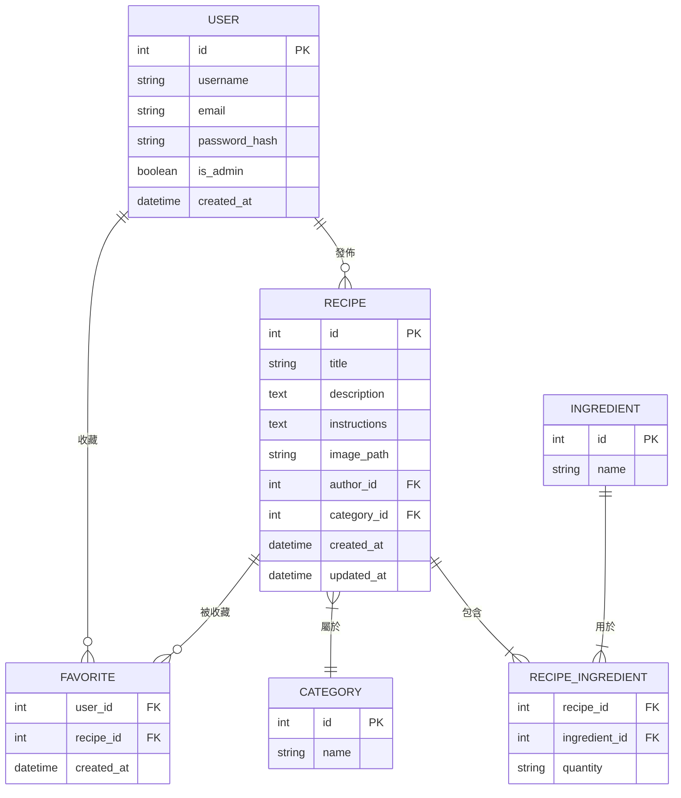

# 資料庫設計文件 (DB_DESIGN.md) - 食譜收藏夾系統

## 1. ER 圖 (實體關係圖)

---

## 2. 資料表詳細說明

### 2.1 Users (使用者表)
儲存使用者的基本資訊與權限。
| 欄位名稱 | 型別 | 說明 | 必填 | 備註 |
| :--- | :--- | :--- | :--- | :--- |
| id | INTEGER | 流水號 | 是 | PRIMARY KEY, AUTOINCREMENT |
| username | VARCHAR(50) | 使用者名稱 | 是 | UNIQUE |
| email | VARCHAR(120) | 電子郵件 | 是 | UNIQUE |
| password_hash | VARCHAR(128) | 密碼雜湊值 | 是 | |
| is_admin | BOOLEAN | 是否為管理員 | 是 | 預設為 False |
| created_at | DATETIME | 帳號建立時間 | 是 | |

### 2.2 Recipes (食譜表)
儲存食譜的主體內容。
| 欄位名稱 | 型別 | 說明 | 必填 | 備註 |
| :--- | :--- | :--- | :--- | :--- |
| id | INTEGER | 流水號 | 是 | PRIMARY KEY, AUTOINCREMENT |
| title | VARCHAR(100) | 食譜標題 | 是 | |
| description | TEXT | 簡介 | 否 | |
| instructions | TEXT | 烹飪步驟 | 是 | |
| image_path | VARCHAR(255) | 圖片存儲路徑 | 否 | |
| author_id | INTEGER | 作者 ID | 是 | FOREIGN KEY (users.id) |
| category_id | INTEGER | 分類 ID | 否 | FOREIGN KEY (categories.id) |
| created_at | DATETIME | 建立時間 | 是 | |
| updated_at | DATETIME | 最後更新時間 | 是 | |

### 2.3 Categories (食譜分類表)
儲存食譜的類別（如：中式、西式、甜點）。
| 欄位名稱 | 型別 | 說明 | 必填 | 備註 |
| :--- | :--- | :--- | :--- | :--- |
| id | INTEGER | 流水號 | 是 | PRIMARY KEY, AUTOINCREMENT |
| name | VARCHAR(50) | 分類名稱 | 是 | UNIQUE |

### 2.4 Ingredients (食材表)
儲存所有可能的食材清單，方便搜尋。
| 欄位名稱 | 型別 | 說明 | 必填 | 備註 |
| :--- | :--- | :--- | :--- | :--- |
| id | INTEGER | 流水號 | 是 | PRIMARY KEY, AUTOINCREMENT |
| name | VARCHAR(50) | 食材名稱 | 是 | UNIQUE |

### 2.5 Recipe_Ingredients (食譜食材關聯表)
處理食譜與食材的多對多關係，並記錄份量。
| 欄位名稱 | 型別 | 說明 | 必填 | 備註 |
| :--- | :--- | :--- | :--- | :--- |
| recipe_id | INTEGER | 食譜 ID | 是 | FK (recipes.id) |
| ingredient_id| INTEGER | 食材 ID | 是 | FK (ingredients.id) |
| quantity | VARCHAR(50) | 份量描述 | 否 | (如：200g, 少許) |

### 2.6 Favorites (收藏關聯表)
處理使用者與收藏食譜的多對多關係。
| 欄位名稱 | 型別 | 說明 | 必填 | 備註 |
| :--- | :--- | :--- | :--- | :--- |
| user_id | INTEGER | 使用者 ID | 是 | FK (users.id) |
| recipe_id | INTEGER | 食譜 ID | 是 | FK (recipes.id) |
| created_at | DATETIME | 收藏時間 | 是 | |

---

## 3. SQL 建表語法 (database/schema.sql)

請參考 `database/schema.sql` 檔案。

---

## 4. Python Models

請參考 `app/models/` 資料夾下的對應模型檔案。
