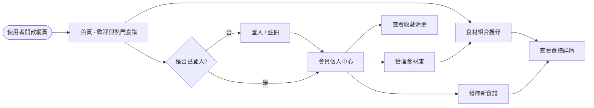
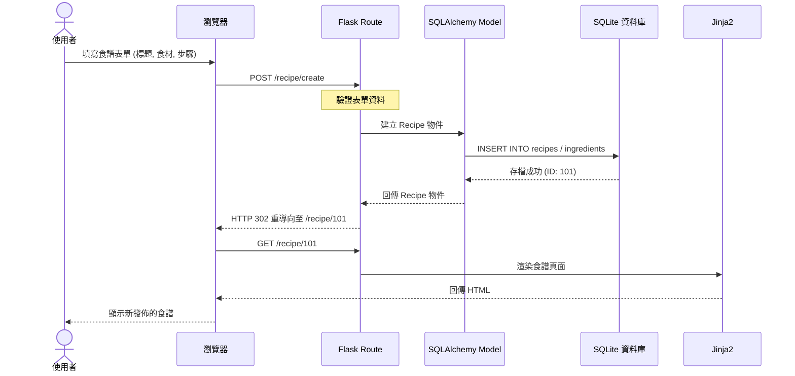

# 流程圖設計 (FLOWCHART.md) - 食譜收藏夾系統

## 1. 使用者流程圖 (User Flow)

此流程圖描述一般使用者進入網站後的主要操作路徑。

---

## 2. 系統序列圖 (Sequence Diagram)

此序列圖以「發佈新食譜」為例，展示資料如何在各層級間流動。

---

## 3. 功能清單對照表

以下整理了系統主要功能所對應的路由與方法：

| 功能名稱 | URL 路徑 | HTTP 方法 | 說明 |
| :--- | :--- | :--- | :--- |
| 首頁 | `/` | GET | 顯示網站介紹與熱門食材/食譜 |
| 使用者註冊 | `/auth/register` | GET/POST | 建立新帳號 |
| 使用者登入 | `/auth/login` | GET/POST | 進入系統 |
| 食材搜尋 | `/search` | GET/POST | 勾選食材並搜尋對應食譜 |
| 食譜詳情 | `/recipe/<id>` | GET | 查看食譜完整內容 |
| 發佈食譜 | `/recipe/create` | GET/POST | 開啟表單並送出食譜內容 |
| 我的收藏 | `/user/favorites` | GET | 顯示使用者收藏的食譜 |
| 管理員儀表板 | `/admin/dashboard` | GET | 管理員專用的審核界面 |

---

## 4. 流程說明

1.  **搜尋核心流程**：使用者不一定要登入即可使用「食材搜尋」功能。系統會讀取 `Search` 表單傳遞的食材 ID 列表，在資料庫中比對包含這些食材的食譜並回傳。
2.  **會員互動流程**：若要「發佈食譜」或「收藏」，則必須經過 `Auth` 檢查。未登入者將被導向登入頁面。
3.  **資料持久化**：所有的寫入動作（如新增帳號、存入食譜）都會通過 `SQLAlchemy Model` 進行格式校驗後，再由 SQLite 執行磁碟寫入。
